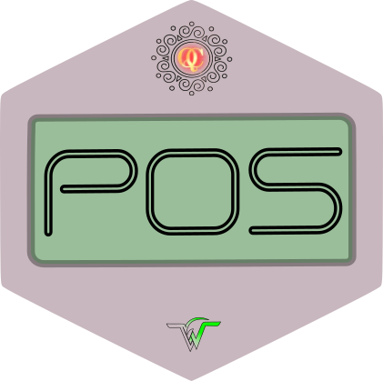

## Introduction

QCL POS is a software engineered specifically for the unique needs of QCL. The System is designed to be highly configurable and adaptable to the needs of different shops, stations, products, staff members, and customers. This manual is intended for system administrators and staff members who will be using and supporting this software. 

With QCL POS, you can easily manage your shops, products, staff members, and customers. You can configure the system to suit your specific needs. 

This manual provides detailed instructions for installing and configuring the system, as well as for using the various features and functionalities of QCL POS. It covers topics such as setting up shops, managing products, preparing orders, processing payments, and managing customers. It also covers advanced topics such as creating custom reports. 

{width=150px} 

_We hope that this manual will be a valuable resource for you as you start using QCL POS. If you have any questions or need further assistance, please don't hesitate to reach out to us._

## System Design Overview

### Architecture

QCL POS is built using Laravel, a PHP framework. Laravel is designed to provide a rich set of features and tools.
It leverages Livewire, a library that allows for real-time, interactive updates to a web page. When you make changes to an order, for example, the changes are automatically reflected on the screen without the need for a page reload. This makes the user experience much more responsive and intuitive.

QCL POS is housed within a virtual machine (VM), which is a good solution for on-site deployment. By using a VM, you can run QCL POS on your own hardware without the need for additional hardware or software. A VM provides a self-contained environment that can be easily installed and managed. It also allows you to easily update and manage the software within the VM, without affecting the rest of your systems.

{width=650px} 

### System Users

The system is intended to be used by the following types of users:

1. **Administrator**: Has full control over the system and can perform any task. Can configure shops, products, staff members, and customers.

2. **Cashiers**: These users are responsible for processing orders and managing the day-to-day operations of the shop. They can create and edit orders as well as manage payment.

3. **Order Takers**: These users are responsible for getting orders from the customers. They can create orders, add products, and monitor the status of orders. Typical usage is through Tablet.

4. **Accountants**: These users are responsible for managing the financial aspects of the shops. They can view and manage payment records, generate reports, and perform other financial tasks.

5. **GRO (Guest Room Operator)**: These users are like cashiers.

### System Stations

The system is intended to be used at the following stations/ terminals:

1. **Administration**: A _Desktop_ PC is requierd for administration purposes. Accountants & Cashiers may also use such terminals.
2. **Cashier Terminals**: Ideally a _PC_ is suitable for a cashiers job, however it can also be done via a _Tablet Device_.
3. **GRO Terminal**: Ideally a _PC_ is suitable for the job, however it can also be done via a _Tablet Device_.
4. **Order Tablet**: Ideally a _Tablet Device_ is suitable for the job, however it can also be done via a _PC_ as well.

## Main Features

### Product Management

Products are anything that can be sold at a Shop. Every product has following fields to hold specifications : -

 * ID
 * Name
 * Description
 * Price
 * Category

 Products need to be set up once before functioning of the system. At later stages products can be edited, deleted or updated as per requirement. Typical usage includes revision of rates on Quarterly basis.

#### Pages

1. **Product Index**. Lists all the products available in POS System. Users can _View_/ _Edit_/ _Delete_ any product. Users can search for a _product_ by _name_ or _description_.

{width=500px} 

2. **Product Add/ Edit**. Simple form for editing product.

{width=500px} 

{width=200px} 

### Category System

POS system is designed to group products into categories. In addition to collecting the products into manageable groups, the category system serves two main purposes : -

1. Shops/ Restaurants can be configured to serve only specific categories. This helps in limiting specific products for sale at respecticve shops/ restaurants.
2. Each category can be assigned to a different _Kitchen Printer_ for printing of "Kitchen Order Ticket" token printing.

#### Pages

1. **Category Index**. Lists all the categories available in POS System. Users can _View_/ _Edit_/ _Delete_ any category.

{width=500px} 

2. **Category View**. Simple form for adding /deleting produts to a category.

{width=500px} 

3. **Category Add/ Edit**. Simple form for editing category. Kitchen Printer IP can be set in edit page.

{width=500px} 

{width=200px} 

### Shops Management

Shops are virtual entities that are used to sell products to users. A Shop has following fields to hold specifications : -

 * ID
 * Name
 * Description
 * Printer IP
 * Categories

 Just like Products, Shops need to be set up once before functioning of the system. At later stages new shops can be created and existing shops can be edited, deleted or updated as per requirement. Typical usage includes opening of a new restaurant.

#### Pages

1. **Shops Index**. Lists all the shops available in POS System. Users can _View_/ _Edit_/ _Delete_ any shop.

{width=500px} 

2. **Shop Add/ Edit**. Make a new Shop or edit an existing one. Shop Printer IP addresse can be configured here.

{width=500px} 

{width=200px} 

### Staff Management

System staff consists of _Admin_, _Cashiers_, _Order Takers_ and _Accountant_. These Users have following fields to hold specifications : -

 * ID
 * first_name
 * last_name
 * type {Admin, Cashier, Order Taker, Accountant}
 * email {Used for login}
 * password

#### Pages

1. **User Index**. Lists all the users configured in the POS System. Admin can _View_/ _Edit_/ _Delete_ any user.

{width=500px} 

2. **User Add/ Edit**. User roles, profile photos and passwords can be changed from these pages.

{width=500px} 

{width=200px} 

### Printers Management
POS System allows you to print saved Orders only. This is to keep from accidental order / KOT printing by novice users. Prints can be triggered from the Order print button group found in _orders index_ page or when viewing an order at the _order show_ page.
 
 {width=100px}

#### PDF Prints

All orders can be printed as a pdf file. This is useful for previewing the bill before printing to printer. It is also useful for record keeping and viewing old orders. The bill shows different text _(Paid, Chit or Part-Chit)_ based on payment info.

%20-%20order_1006.pdf.jpg){width=200px} 

%20-%20order_1005.pdf.jpg){width=200px} 

%20-%20order_1004-1.pdf.jpg){width=200px} 

#### POS Prints

POS prints are sent automatically to _Shop Printer_ configured in _Shop settings_.

#### KoT Prints (Kitchen Order Tickets)

KoT prints are sent automatically to _Kitchen Printers_ based on product categories for printing tickets/ tokens.
 
## Advanced Operations

### Backups/ Restore

#### Backups

The system supports backing up existing records in excel format. Following entities can be backed-up : -

1. Users
2. Shops
3. Products (including categories)
4. Customers

{width=500px} 

#### Restoration

Backup files (.xlsx) can be used to restore the system to a previous state in case of errors. Please note that restore is a delicate process and only valid excel files can be used. In case of any error the complete file will be rejected.

### Reports

System generates automatic reports based on user filters. Common filters include : -
1. Date Range.
2. Shops for which records need to be filtered.

System generates following reports : -

#### Shop Sale Report

This is a sale report. It groups shop-wise the sales performed during the selected date range. Report can be used to close a sales day.

{width=500px} 

{width=500px} 

#### Cashiers Report

Cashiers report pivots the sales data by grouping on the Cashiers. This report can benefit during closing a sales day. It shows all payments taken in cash by respective cashiers.

{width=500px} 

{width=500px} 

{width=500px} 

#### Products Report

By the end of a sales period it can be beneficial to know your top selling products as well as top grossing products. This report can be used to order logistics as per perceived sale of products.

{width=500px} 

{width=500px} 

## Troubleshooting

* Common issues and solutions.
* Error messages and their meanings.

## Usage Guides

### Setting up Staff

1. Prepare a list of all employees that will be using the system.
2. Enumerate the roles of all staff members, i.e cashiers, admin, order-takers, etc.
3. Goto _Users Index_ page and click on "Add New" button.
4. Fill the form for creating a new user and hit "Submit".

 * **_Note_** : Password fields are mandatory for new users, however old users data can be updated without changing password if password field is left blank. 
 
### Setting up Products

1. Prepare a list of all products that will be added in the system.
2. Goto _Settings_ page and click on "Export Products" button to get a sample excel sheet.
3. Edit the downloaded excel sheet with following columns :

Ser        Field Name       Remarks
---        -----            -------
a.         'id'             - Optional field (Leave unchanged if you are updating existing menu).
b.         'name'           - Product Name.
c.         'description'    - Product Description (Serving, no of bowls, size, etc).
d.         'category'       - Name of category (See Category System for details).
e.         'price'          - Price of product.
f.         'created_at'     - Optional field.

3. Goto _Settings_ page and see "Upload a Products File". Hit the "Browse" button and submit your excel file for uploading.
4. Click on "Import Products" button after file selection and wait for system redirect.
5. If you are taken to _Products Index_ page with message "All Ok", all your products have been uploaded.
6. In case you are redirected back to _Settings_ page, there was an error processing the file. recheck all entries and try again.

 * **_Note_** : Bulk Uploading via excel files is prone to error if empty fields or invalid data is present. Please sanitize excel file carefully before uploading. 

### Setting up Categories

1. If category name is uploaded in excel sheet (Products.xlsx), it automatically creates required categories. Printer IPs are however still required to be configured one by one.
2. New Categories can be added like other entities.
3. Products need to be removed from all categories before re-assignment. (Product can be added in only 1 category at a time.)

### Setting up Shops

1. Prepare a list of all shops/ restaurants that will be requiring the POS system.
2. Enumerate the categories that the shop will be serving.
3. Goto _Shops Index_ page and click on "Add New" button.
4. Fill the form for creating a new shop and hit "Submit".

 * **_Note_** : New Shops dont have any categories assigned by default. Assign categories to any shop in _Shop Edit Page_.

### Setting up Printers

POS System uses two thermal printers for every order. These are : -

1. **POS Prints** _(Customer/ Shop bill)_. Shop Bill is the main order print for every order. It shows Shop info, Customer info, items, quantities, rates, prices and discounts. This bill can be handed over to customer and copy can be kept at shop for record keeping purposes. For setting up a thermal printer to a shop, use _Shop Edit_ page for setting "Shop Printer IP" address of the printer. Now shop bill prints will be automatically printed on this printer.

2. **KoT Prints** _(Kitchen Order Ticket)_. KoT prints the tickets for item preparation at kitchen, etc. Each category of products can be assigned a seperate network thermal printer. This printer is configured in _Category Edit_ page, set the "Kitchen Printer IP" to use the print function.

**_Note_**: Both bills can be printed on a single network thermal printer, however it is advised to keep seperate printers for these jobs. 

### Managing Shop Categories

Shops/ Restaurants can only serve item categories assigned by the admin. For assigning a category to a shop, go to _Shop Edit_ page and select the categories you wish to serve from the shop, hit "Update" button to save changes.
<!-- 
### Closing Sales Day

### Accounting

Format       | File Extension | Format       | File Extension | Image
------------ | -------------- | ------------ | -------------- | -----
BibLaTeX     | .bib           | BibLaTeX     | .bib           | {width=120px}
BibTeX       | .bibtex        | BibTeX       | .bibtex        |
CSL JSON     | asd            | CSL JSON     | asd            |
CSL YAML     | .yaml          | CSL YAML     | .yaml          |

Format        File Extension  Format        File Extension  Image
------------  --------------  ------------  --------------  -----
BibLaTeX      .bib            BibLaTeX      .bib            {width=10px}
BibTeX        .bibtex         BibTeX        .bibtex        
CSL JSON      asd             CSL JSON      asd            
CSL YAML      .yaml           CSL YAML      .yaml           -->

<!-- ## Appendix -->

<!-- ### List of Images -->

<!-- ImageName       |  Image
-----    |  -------------------- -->
<!-- 

%20-%20order_1006.pdf.jpg)
%20-%20order_1005.pdf.jpg)
%20-%20order_1004-1.pdf.jpg)

 -->
